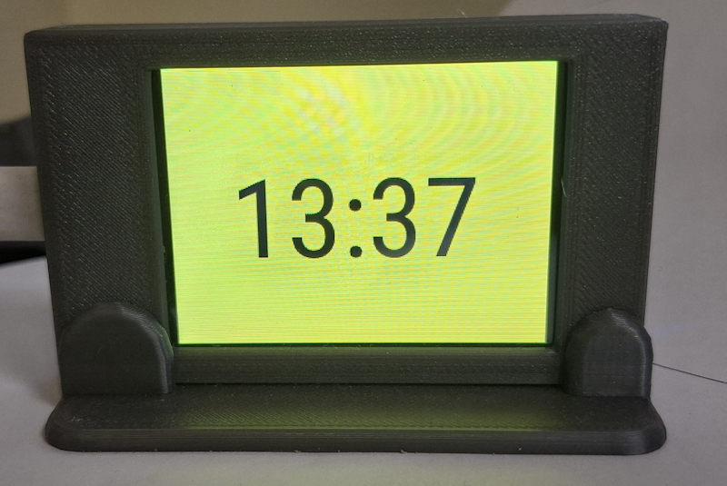
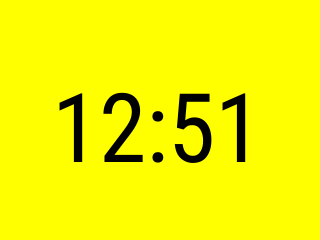
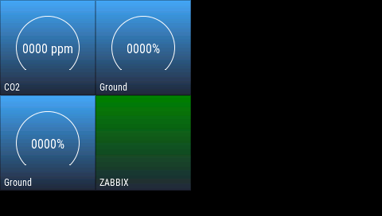
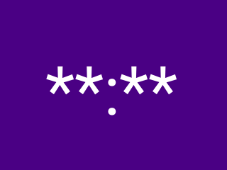

# zabbix-openhasp-semaphore

Visual monitoring indicator for Zabbix using openHASP devices.

Проект предназначен для отображения общего состояния Zabbix
на одном или нескольких экранах openHASP в виде цветового индикатора
(«светофора») с автоматической регулировкой яркости по времени восхода/заката.

## Links

- **openHASP:** https://www.openhasp.com
- **Zabbix:** https://www.zabbix.com

---



---

## 🇬🇧 English

### Overview

`zabbix-openhasp-semaphore` is a Python script that:

- Connects to **Zabbix 7.x** via **JSON-RPC API**
- Analyzes current **active problems**
- Determines the **maximum problem severity**
- Converts severity into a visual state (**green / yellow / red**)
- Sends the resulting state to one or more **openHASP** devices via **MQTT**
- **Automatically adjusts screen brightness** based on sunrise/sunset times

The visual severity level matches what you see in the Zabbix web interface.

---

### Severity to Color Mapping

| Zabbix Severity | Meaning               | Color  |
|-----------------|----------------------|--------|
| 0–1             | OK / Information     | Green  |
| 2–3             | Warning / Average    | Yellow |
| 4–5             | High / Disaster      | Red    |

---

  
*Zabbix openHASP semaphore — WARNING*

  
*Zabbix openHASP semaphore — CRITICAL*

  
*Zabbix openHASP semaphore — widgets*

  
*Zabbix openHASP semaphore — NO DATA*

---

### What is taken into account

- Only **active problems**
- **Disabled triggers are ignored**
- **Disabled hosts are ignored**
- Host association is resolved via:
  - `event.get`
  - fallback to `trigger.get` if needed
- Host information is logged as:
  - technical host name
  - visible name (as shown in Zabbix UI)

---

### openHASP device handling

- Device behavior is defined using **reusable templates**
- A template describes a sequence of MQTT commands sent to the screen
- Multiple devices can share the same template
- Device-to-template mapping is defined **directly in the script**

**Built-in templates:**

| Template      | Description                                      |
|---------------|--------------------------------------------------|
| `default`     | Basic background color + idle off                |
| `with_time`   | Background + time display + auto brightness      |
| `widgets`     | Widget-based layout with time display            |

This allows different openHASP screens to display the same Zabbix state
using different layouts or UI logic.

---

### Requirements

- Python 3.8+
- Zabbix **7.x**
- openHASP devices
- MQTT broker

Python dependencies:

```bash
pip install requests paho-mqtt python-dotenv suntime
````

---

### Configuration

Sensitive configuration is provided via environment variables.
Create a `.env` file in the project root directory based on `.env.example`:

```bash
cp .env.example .env
nano .env
```

Available environment variables:

| Variable             | Description                          | Default Value                                                                  |
| -------------------- | ------------------------------------ | ------------------------------------------------------------------------------ |
| ZABBIX_URL           | Zabbix API URL                       | [http://127.0.0.1:8080/api_jsonrpc.php](http://127.0.0.1:8080/api_jsonrpc.php) |
| ZABBIX_API_TOKEN     | Zabbix API token                     | YOUR_ZABBIX_API_TOKEN                                                          |
| MQTT_BROKER          | MQTT broker address                  | mqtt.example.com                                                               |
| MQTT_USER            | MQTT username                        | mqtt_user                                                                      |
| MQTT_PASS            | MQTT password                        | mqtt_pass                                                                      |
| IGNORE_ACKNOWLEDGED  | Ignore acknowledged problems         | True                                                                           |
| DEBUG                | Enable debug output (True/False)     | True                                                                           |
| LATITUDE             | Location latitude                    | 55.7558 (Moscow)                                                               |
| LONGITUDE            | Location longitude                   | 37.6173 (Moscow)                                                               |
| TIMEZONE             | Timezone name                        | Europe/Moscow                                                                  |
| SUNRISE_OFFSET_HOURS | Offset from sunrise (hours)          | 0.5 (30 min after sunrise)                                                     |
| SUNSET_OFFSET_HOURS  | Offset from sunset (hours)           | 0.5 (30 min after sunset)                                                      |
| BRIGHTNESS_DAY       | Day brightness (0-100)               | 70                                                                             |
| BRIGHTNESS_NIGHT     | Night brightness (0-100)             | 5                                                                              |
| BRIGHTNESS_TWILIGHT  | Twilight brightness (0-100)          | 20 (auto-calculated as average)                                                |

openHASP devices and their behavior templates are configured **inside the script**.

---

### How it works

1. Query Zabbix API for current problems
2. Filter out:
   * disabled triggers
   * disabled hosts
   * acknowledged problems (if `IGNORE_ACKNOWLEDGED=True`)
3. Determine the maximum severity
4. Convert severity to a color state
5. Calculate current brightness based on sunrise/sunset times
6. Publish MQTT commands to openHASP devices according to their templates

---

### Running

Manual run:

```bash
python3 semafor.py
```

Cron example:

```cron
*/1 * * * * cd /path/to/project && python3 semafor.py
```

With explicit environment variables:

```cron
*/1 * * * * ZABBIX_URL=http://your-zabbix/api MQTT_BROKER=your-mqtt-broker python3 /path/to/semafor.py
```

---

### Debug mode

Enable detailed output:

```env
DEBUG=True
```

Debug output includes:

* Zabbix API calls (high-level)
* detected problems
* associated hosts
* final severity and color decision
* sunrise/sunset times and brightness calculation
* openHASP template commands being sent

---

## 🇷🇺 Русский

### Описание

`zabbix-openhasp-semaphore` — это Python-скрипт, который:

* Подключается к **Zabbix 7.x** через **JSON-RPC API**
* Анализирует текущие **активные проблемы**
* Определяет **максимальный уровень серьёзности**
* Преобразует severity в цветовое состояние (**green / yellow / red**)
* Отправляет итоговое состояние на экраны **openHASP** через **MQTT**
* **Автоматически регулирует яркость экрана** по времени восхода/заката

Отображаемый цвет соответствует состоянию в веб-интерфейсе Zabbix.

---

### Соответствие уровней и цветов

| Уровень Zabbix | Значение          | Цвет    |
| -------------- | ----------------- | ------- |
| 0–1            | OK / Information  | Зелёный |
| 2–3            | Warning / Average | Жёлтый  |
| 4–5            | High / Disaster   | Красный |

---

### Что учитывается

* Только **активные проблемы**
* **Отключённые триггеры игнорируются**
* **Отключённые хосты игнорируются**
* Привязка события к хостам определяется через:

  * `event.get`
  * резервно через `trigger.get`
* В логах отображаются:

  * техническое имя хоста
  * отображаемое имя (как в Zabbix UI)

---

### Работа с openHASP

* Поведение экранов описывается через **шаблоны**
* Шаблон — это последовательность MQTT-команд
* Несколько устройств могут использовать один и тот же шаблон
* Привязка устройств к шаблонам задаётся **в коде скрипта**

**Встроенные шаблоны:**

| Шаблон        | Описание                                           |
|---------------|----------------------------------------------------|
| `default`     | Базовый цвет фона + отключение idle                |
| `with_time`   | Фон + отображение времени + автояркость            |
| `widgets`     | Виджетная раскладка с отображением времени         |

Это позволяет легко менять внешний вид экранов
без дублирования логики.

---

### Требования

* Python 3.8+
* Zabbix **7.x**
* openHASP устройства
* MQTT брокер

Зависимости Python:

```bash
pip install requests paho-mqtt python-dotenv suntime
```

---

### Настройка

Чувствительные параметры задаются через переменные окружения.
Создайте файл `.env` на основе `.env.example`:

```bash
cp .env.example .env
nano .env
```

Доступные переменные:

| Переменная           | Описание                         | Значение по умолчанию                                                          |
| -------------------- | -------------------------------- | ------------------------------------------------------------------------------ |
| ZABBIX_URL           | URL API Zabbix                   | [http://127.0.0.1:8080/api_jsonrpc.php](http://127.0.0.1:8080/api_jsonrpc.php) |
| ZABBIX_API_TOKEN     | API-токен Zabbix                 | YOUR_ZABBIX_API_TOKEN                                                          |
| MQTT_BROKER          | Адрес MQTT брокера               | mqtt.example.com                                                               |
| MQTT_USER            | Пользователь MQTT                | mqtt_user                                                                      |
| MQTT_PASS            | Пароль MQTT                      | mqtt_pass                                                                      |
| IGNORE_ACKNOWLEDGED  | Игнорировать подтверждённые      | True                                                                           |
| DEBUG                | Отладочный вывод                 | True                                                                           |
| LATITUDE             | Широта местоположения            | 55.7558 (Москва)                                                               |
| LONGITUDE            | Долгота местоположения           | 37.6173 (Москва)                                                               |
| TIMEZONE             | Часовой пояс                     | Europe/Moscow                                                                  |
| SUNRISE_OFFSET_HOURS | Смещение от восхода (часы)       | 0.5 (через 30 мин после восхода)                                               |
| SUNSET_OFFSET_HOURS  | Смещение от заката (часы)        | 0.5 (через 30 мин после заката)                                                |
| BRIGHTNESS_DAY       | Дневная яркость (0-100)          | 70                                                                             |
| BRIGHTNESS_NIGHT     | Ночная яркость (0-100)           | 5                                                                              |
| BRIGHTNESS_TWILIGHT  | Яркость в сумерках (0-100)       | 20 (автоматически — среднее между дневной и ночной)                            |

Список openHASP устройств и их шаблоны задаются в коде.

---

### Принцип работы

1. Получение активных проблем из Zabbix
2. Фильтрация отключённых объектов
3. Фильтрация подтверждённых проблем (если `IGNORE_ACKNOWLEDGED=True`)
4. Определение максимального severity
5. Преобразование severity в цвет
6. Расчёт текущей яркости по времени восхода/заката
7. Отправка команд на openHASP через MQTT

---

### Запуск

Вручную:

```bash
python3 semafor.py
```

Через cron:

```cron
*/1 * * * * cd /path/to/project && python3 semafor.py
```

С явным указанием переменных окружения:

```cron
*/1 * * * * ZABBIX_URL=http://your-zabbix/api MQTT_BROKER=your-mqtt-broker python3 /path/to/semafor.py
```

---

## Отладочный режим

Включите подробный вывод:

```env
DEBUG=True
```

Отладочный вывод включает:

* Вызовы Zabbix API (общий уровень)
* Обнаруженные проблемы
* Привязку к хостам
* Итоговый severity и решение о цвете
* Время восхода/заката и расчёт яркости
* Команды openHASP, отправляемые по MQTT

## License

MIT
